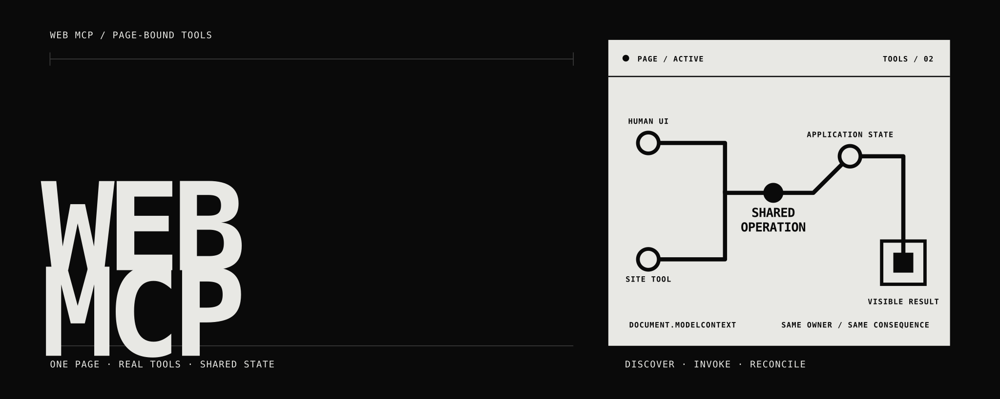

# Web MCP Skills

Create or extend web applications whose normal interface and WebMCP tools operate the same real product state. The repository contains two portable Agent Skills—`web-mcp` for product implementation and `web-mcp-design` for visual execution—plus three runnable reference applications, official-source snapshots, public documentation, repository visuals, and release automation.

[](https://github.com/povvo/web-mcp-skills/actions/workflows/validate-skills.yml)

WebMCP is an experimental web standard for pages that expose structured tools through `document.modelContext`. The `web-mcp` skill turns that API into a complete implementation workflow: product journey, canonical operations, UI, tool contracts, generated adapters, optional MCP composition, tests, host checks, and release evidence. The companion `web-mcp-design` skill supplies the source-independent visual system used by the repository and examples.

## Install

Inspect the available skills:

```bash
npx skills add povvo/web-mcp-skills --list
```

The repository is private, so remote discovery and installation require GitHub authentication with access to `povvo/web-mcp-skills`.

Install `web-mcp` into the current project:

```bash
npx skills add povvo/web-mcp-skills --skill web-mcp
```

Install the visual-system skill:

```bash
npx skills add povvo/web-mcp-skills --skill web-mcp-design
```

Install both globally for Codex:

```bash
npx skills add povvo/web-mcp-skills --skill '*' --agent codex --global --yes
```

The installable trees are [`skills/web-mcp`](skills/web-mcp) and [`skills/web-mcp-design`](skills/web-mcp-design). Each is self-contained and contains no `node_modules`, repository `/docs` dependency, virtual environment, or build cache.

## Run the examples

```bash
cd examples
npm start
```

Open `http://127.0.0.1:4173`.

| Example | Human-agent operation | WebMCP tools |
| --- | --- | --- |
| [Shared Board](examples/shared-board) | Inspect and add against a revisioned board | `inspect_board`, `add_board_item` |
| [Release Rail](examples/release-rail) | Inspect, advance, and reopen a finite sequence | `inspect_release_rail`, `advance_release_step`, `reopen_release_step` |
| [Evidence Desk](examples/evidence-desk) | Inspect, select, and annotate explicit evidence states | `inspect_evidence_desk`, `select_evidence_record`, `annotate_evidence_record` |

Each example is dependency-free, uses local browser storage, labels sample data, and remains usable when WebMCP is unavailable. Each generated adapter was compiled by the skill from a product contract and tool manifest.

## Documentation

Start with the [field manual](docs/README.md):

- [What WebMCP is](docs/what-webmcp-is.md)
- [Using the skill](docs/using-the-skill.md)
- [How the examples work](docs/examples.md)
- [WebMCP, MCP, and operation ownership](docs/architecture.md)
- [Testing and evidence](docs/testing-and-evidence.md)
- [Release and sharing](docs/release-and-sharing.md)
- [Official material snapshots and provenance](docs/official/README.md)

The public docs synthesize the supplied official materials in a task-oriented voice. The original snapshots remain unchanged under `docs/official/snapshots/` because source evidence should not be improved by copyediting.

## Verify

Run the repository checks:

```bash
npm test
python -B skills/web-mcp/scripts/webmcp_toolkit.py self-test --profile full --format text
```

The checks validate the portable skill, run 12 application/adapter tests, validate every product contract, and compare each checked-in generated adapter with a clean regeneration. CI also smoke-installs the skill through the current `skills` CLI.

Native browser, ChatGPT Site tools, live model, MCP transport, and deployment evidence are separate gates. See [Testing and evidence](docs/testing-and-evidence.md) for the exact boundary.

## Repository layout

```text
skills/web-mcp/          portable WebMCP implementation skill
skills/web-mcp-design/   portable visual-system skill
examples/                three runnable WebMCP applications
docs/                    public manual and official snapshots
assets/                  repository banner
.github/                 structural, compiler, example, and install validation
```

## License

A repository-wide license for the original project must be selected before public release. JetBrains Mono files under `examples/_shared/fonts/` remain under OFL-1.1; the copied WebMCP reports remain under the W3C Software and Document License; the OpenAI Site tools snapshot is not covered by the project license. See [Third-party notices](docs/third-party-notices.md) for the exact boundary.
